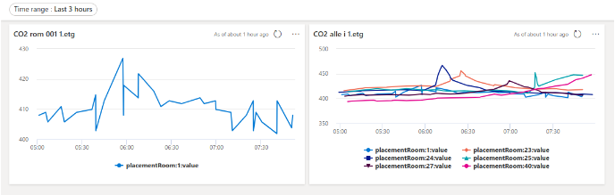

# realestate-azure-client-lib

Distribute Sensor Observations to Azure IoT Hub and to Azure Data Explorer.

Sensor observations are imported from eg. Metasys using the [RealEstate CloudConnector](https://github.com/Cantara/realestate-metasys-cloudconnector-agent)

## Azure IoT HUB configuration

### Create IoT Hub
See the official [Azure IoT Hub documentation](https://docs.microsoft.com/en-us/azure/iot-hub/iot-hub-create-through-portal) for details.

### Create IoT Hub Device
See the official [Azure Create Device documentation](https://docs.microsoft.com/en-us/azure/iot-hub/iot-hub-create-through-portal#create-a-device-identity) for details.
From the Device's config page copy the "Primary connection string".
This string need to be copied to the local_override.properties in CloudConnector, "distribution.azure.connectionString="

### Verify observations distribution
Startup the CloudConnector and verify that observations are distributed to Azure IoT Hub.

1. In the logfile (logs/metasys..log) you should see something like this:
```
Establishing and verifying connection to Azure.
```
2. CloudConnector Health on http://<server>:<port>/cloudconnector/health/pretty - look for:
```
"AzureObservationDistributionClient-isConnected: ": "true",
"AzureObservationDistributionClient-numberofMessagesObserved: ": "1",
```

### Veriyf data in Azure IoT Hub
In the IoT Hub, select the "Metrics" menu item.
Create a new chart with the following settings:
```
Sum Routing: telemetry messages delivered for <your IoT Hub>
```

## Azure Data Explorer configuration

### Create Azure Data Explorer database
See the official [Azure Data Explorer documentation](https://docs.microsoft.com/en-us/azure/data-explorer/create-cluster-database-portal) for details.

### Create Data Connection from IoT Hub to Azure Data Explorer
In the "Overview" of the Azure Data Explorer database, select the "IoT Hub" button, under "Data connections".
See the officail [Azure Data Explorer documentation](https://docs.microsoft.com/en-us/azure/data-explorer/create-iot-hub-connection?tabs=portal) for details.

### Mapping of CloudConnector observations to  Json Telemetry Mapping
See [JsonMapping input from IoTHub to ADX](https://learn.microsoft.com/en-us/azure/data-explorer/kusto/management/json-mapping) for details.
"Name": JsonTelemetryMapping,
"Kind": Json,
"Mapping":
```
 [{
 	"column": "messageId",
 	"path": "$.messageId",
 	"datatype": "",
 	"transform": null
 }, {
 	"column": "sensorId",
 	"path": "$.sensorId",
 	"datatype": "",
 	"transform": null
 }, {
 	"column": "tfm",
 	"path": "$.tfm",
 	"datatype": "",
 	"transform": null
 }, {
 	"column": "realEstate",
 	"path": "$.realEstate",
 	"datatype": "",
 	"transform": null
 }, {
 	"column": "building",
 	"path": "$.building",
 	....
```
See [JsonTelemetryMapping](./JsonTelemetryMapping.json) for the full mapping.


# Development

## Build
```
mvn clean install
```

## Manual verification

Run [AzureDeviceClientmanualTest](src/test/java/no/cantara/realestate/azure/iot/AzureDeviceClientManualTest.java) from your IDE.
